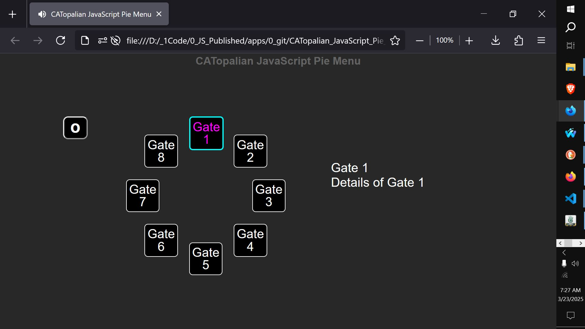

# CATopalian JavaScript Pie Menu
A JavaScript application that creates a Pie Menu using trigonometry.  

USE APP: https://christopherandrewtopalian.github.io/CATopalian_JavaScript_Pie_Menu/CATopalian_JavaScript_Pie_Menu.html  

If you enjoy my apps and tutorials please consider buying me a coffee at [paypal.me/keystonermarch](https://www.paypal.com/paypalme/keystonermarch)  

---

### How to Download this App
1. Click the green Code Button on this github page
2. Choose Download ZIP
3. Save the Zip File
4. Extract All
5. Double click the HTML file to start the App

---

Happy Scripting :-)

